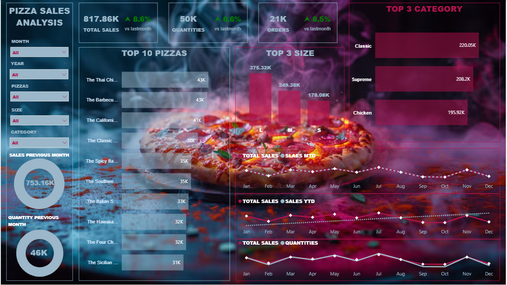

🍕 Pizza Sales Analysis Dashboard – Power BI
📊 Dashboard Preview

📌 Project Overview

This project showcases an interactive Pizza Sales Analysis Dashboard built using Power BI to monitor sales performance, track KPIs, and identify revenue-driving categories and products.

The dashboard provides clear business insights through dynamic visuals and trend analysis.

🎯 Business Objective

To analyze pizza sales data and help stakeholders:

Track overall sales performance

Monitor month-over-month growth

Identify top-performing pizza categories and sizes

Analyze product-level performance

Improve revenue strategy through data-driven decisions

📈 Key Performance Indicators (KPIs)

Total Sales: 817.86K

Total Orders: 21K

Total Quantities Sold: 50K

Month-over-Month Growth: +8.6%

🔎 Key Insights

The Classic category generated the highest revenue (220K+).

Large size pizzas contributed the maximum sales (375K+).

Top-performing pizzas include Thai Chicken and Barbecue variants.

Sales show a steady upward trend across multiple months.

🛠 Tools & Technologies Used

Power BI

DAX

Power Query

Data Modeling

KPI & Trend Analysis
